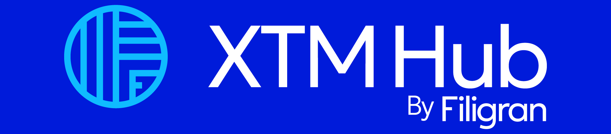
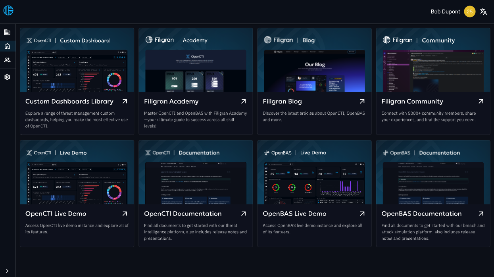

<h1 align="center">
  
</h1>

  
  
  
  

## Introduction

[XTM Hub](https://filigran.io/solutions/xtm-hub/) is the **unified entry point** for Filigran's ecosystem. It allows community members, prospects and customers to easily discover our offerings, access resources, and engage with one another.

## Objective

The goal is simple: **grow the Filigran community** by boosting acquisition and engagement.

- **A marketplace of resources** → to improve product discovery and usage
- **A platform for knowledge sharing** → to empower our community
- **A hub for engagement** → to convert free users into customers, enhance retention, and better understand our audience’s needs

## Documentation

If you want to know more on XTH Hub, you can read the [documentation on the tool](https://docs.hub.filigran.io).

## Releases download

The releases are available on the [Github releases page](https://github.com/FiligranHQ/xtm-hub/releases). You can also access the [rolling release package](https://github.com/FiligranHQ/xtm-hub/tags) generated from the main branch of the repository.

## Installation

All you need to install the XTM Hub platform can be found in the [official documentation](https://docs.hub.filigran.io).

## Contributing

### Code of Conduct

XTM Hub has adopted a [Code of Conduct](CODE_OF_CONDUCT.md) that we expect project participants to adhere to. Please read the [full text](CODE_OF_CONDUCT.md) so that you can understand what actions will and will not be tolerated.

### Contributing Guide

Read our [contributing guide](CONTRIBUTING.md) to learn about our development process, how to propose bugfixes and improvements, and how to build and test your changes to XTM Hub.

### Beginner friendly issues

To help you get you familiar with our contribution process, we have a list of [beginner friendly issues](https://github.com/OpenCTI-Platform/opencti/labels/beginner%20friendly%20issue) which are fairly easy to implement. This is a great place to get started.

### Development

If you want to actively help OpenCTI, we created a [dedicated documentation](https://docs.opencti.io/latest/development/environment_ubuntu/) about the deployment of a development environment and how to start the source code modification.

## Community

### Status & bugs

Currently XTM Hub is under heavy development, if you wish to report bugs or ask for new features, you can directly use the [Github issues module](https://github.com/FiligranHQ/xtm-hub/issues).

### Discussion

If you need support or you wish to engage a discussion about the XTM Hub platform, feel free to join us on our [Slack channel](https://community.filigran.io). You can also send us an email to contact@filigran.io.

## About

### Authors

XTM Hub is a product designed and developed by the company [Filigran](https://filigran.io).

