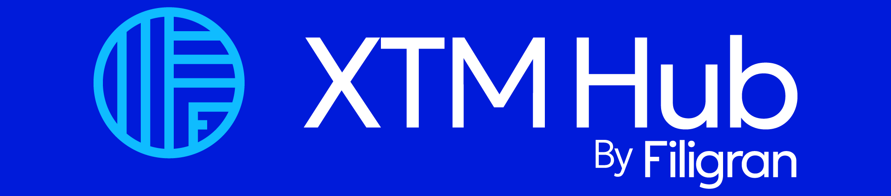
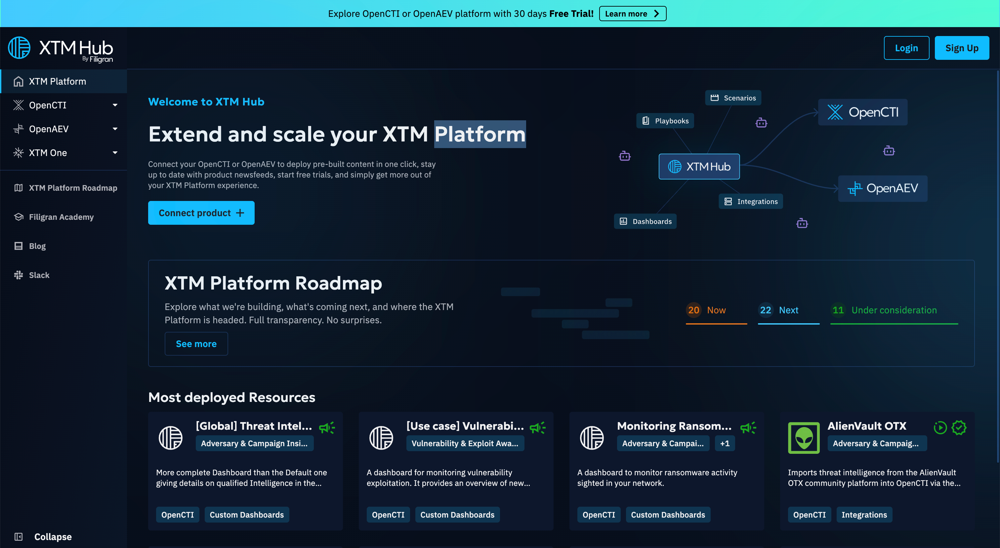
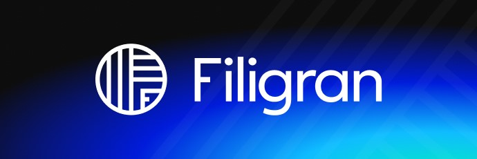

<h1 align="center">
  
</h1>

  
  
  
  

## Introduction

[XTM Hub](https://hub.filigran.io/en) is the **unified entry point** for Filigran's ecosystem. It allows community members, prospects and customers to easily discover our offerings, access resources, and engage with one another.

## Table of contents

- [What you can do with XTM Hub](#what-you-can-do-with-xtm-hub)
- [Objective](#objective)
- [Documentation](#documentation)
- [Releases](#releases)
- [Installation](#installation)
- [Contributing](#contributing)
- [Community](#community)
- [About](#about)

## What you can do with XTM Hub

XTM Hub brings together, in a single place, everything you need to get the most out of the Filigran XTM Platform.

### Discover and reuse ready-made content

- **OpenCTI custom dashboards** — import dashboards built by Filigran instead of starting from a blank page.
- **OpenCTI custom views** — reuse curated views tailored to specific analysis workflows.
- **OpenCTI integrations & playbooks** — browse connectors and automation playbooks to plug OpenCTI into your existing stack.
- **OpenAEV scenarios** — deploy attack simulation scenarios to validate your defenses.

### Try, connect and manage your products

- **Free trials** — spin up an OpenCTI or OpenAEV trial instance in a few clicks.
- **Product connection** — connect your OpenCTI and OpenAEV products to your organization to unlock Hub services and deploy resources directly from the Hub.
- **Organization management** — invite members, manage roles and capabilities, and control who can access what.

### Stay connected to the ecosystem

- **XTM Platform roadmap** — follow what is coming next and give feedback on upcoming features.
- **Resources & news** — access documentation, the Filigran Academy, the blog and community channels from one place.

## Objective

The goal is simple: **grow the Filigran community** by boosting acquisition and engagement.

- **A marketplace of resources** → to improve product discovery and usage
- **A platform for knowledge sharing** → to empower our community
- **A hub for engagement** → to convert free users into customers, enhance retention, and better understand our audience's needs

## Documentation

If you want to know more about XTM Hub, you can read the [documentation on the tool](https://docs.hub.filigran.io).

## Releases

Releases are available on the [GitHub releases page](https://github.com/FiligranHQ/xtm-hub/releases). You can also access the [rolling release package](https://github.com/FiligranHQ/xtm-hub/tags) generated from the main branch of the repository.

## Installation

Everything you need to install the XTM Hub platform can be found in the [official documentation](https://docs.hub.filigran.io).

## Contributing

### Code of conduct

XTM Hub has adopted a [Code of Conduct](CODE_OF_CONDUCT.md) that we expect project participants to adhere to. Please read the [full text](CODE_OF_CONDUCT.md) so that you can understand what actions will and will not be tolerated.

### Contributing guide

Read our [contributing guide](CONTRIBUTING.md) to learn about our development process, how to propose bugfixes and improvements, and how to build and test your changes to XTM Hub.

### Beginner friendly issues

To help you get familiar with our contribution process, we maintain a list of [beginner friendly issues](https://github.com/FiligranHQ/xtm-hub/issues?q=is%3Aissue%20state%3Aopen%20label%3A%22good%20first%20issue%22) that are fairly easy to implement. This is a great place to get started.

### Development

If you want to actively help XTM Hub, we created a [dedicated documentation](https://docs.hub.filigran.io/) about deploying a development environment and getting started with modifying the source code.

## Community

### Status & bugs

XTM Hub is currently under heavy development. If you wish to report bugs or ask for new features, you can directly use the [GitHub issues module](https://github.com/FiligranHQ/xtm-hub/issues).

### Discussion

If you need support or you wish to start a discussion about the XTM Hub platform, feel free to join us on our [Slack channel](https://community.filigran.io). You can also send us an email at contact@filigran.io.

## About

### Authors

XTM Hub is a product designed and developed by the company [Filigran](https://filigran.io).

